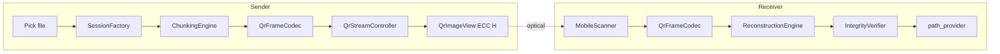

# PhotonLink Architecture

## Overview

PhotonLink is an offline peer-to-peer file transfer platform using optical communication (QR codes, color matrices, visual frame streams). **Phase 2** implements the QR-based optical file transfer MVP with a transport-independent transfer core and an isolated QR codec/stream layer.

## Layer Diagram

```
┌──────────────────────────────────────────────────────────┐
│  features/  home · transfer_setup · qr_transfer · about   │
│             camera_scan · file_picker (non-QR prototypes)  │
├──────────────────────────────────────────────────────────┤
│  transfer/  core (chunking, reconstruction, integrity)   │
│             qr (frame codec, stream controller)          │
│             application (Riverpod controllers)           │
├──────────────────────────────────────────────────────────┤
│  protocols/ interfaces + impl (QrProtocol)               │
│  settings/  │  history/  │  shared/widgets/  │  ui/       │
├──────────────────────────────────────────────────────────┤
│  core/  bootstrap · router · theme · constants · errors  │
└──────────────────────────────────────────────────────────┘
         │                              │
         ▼                              ▼
   SharedPreferences              native/photonlink_core
   (settings, history,            (Rust stub — future FFI)
    session progress)
```

## Dependency Rules

| Layer | May import from | Must NOT import |
|-------|----------------|-----------------|
| `ui/` | (none — leaf) | everything else |
| `core/` | `ui/`, `services/` | `features/` |
| `services/` | `core/` | widgets, features |
| `protocols/` | `core/`, `transfer/core/` | widgets, features |
| `transfer/core/` | `protocols/interfaces/` | widgets, features, `transfer/qr/` |
| `transfer/qr/` | `protocols/`, `transfer/core/` | widgets, features |
| `transfer/application/` | `transfer/*`, `history/`, `services/` | widgets |
| `features/` | all above | — |

**Key rule:** Color Matrix (Phase 3+) can reuse `transfer/core/` and `protocols/interfaces/` without importing `transfer/qr/`.

## QR Transfer Data Flow



## Wire Format (PL2)

```
PL2|<type>|<sessionId>|<seq>|<total>|<base64Payload>
```

- `M` = metadata JSON (fileName, fileSize, totalChunks, sha256, mimeType)
- `D` = raw chunk bytes (Base64)

High QR error correction (`QrErrorCorrectLevel.H`). Sender loops all frames at adjustable FPS; receiver deduplicates by chunk ID.

## Transport-Independent Interfaces

Located in `lib/protocols/interfaces/`:

| Interface | Role |
|-----------|------|
| `TransferPacket` | Sealed: `MetadataPacket`, `DataPacket` |
| `TransferSession` | Session id, file info, state, progress |
| `TransferEncoder` | `encodeFrame(packet) → String` |
| `TransferDecoder` | `decodeFrame(raw) → TransferPacket?` |
| `ChunkManager` | `split()` / `merge()` |

Phase 1 legacy interfaces (`Encoder`, `Decoder`, `Packetizer`, etc.) remain for registry compatibility; `QrProtocol` delegates to Phase 2 core.

## State Management (Riverpod 2)

| Provider | Purpose |
|----------|---------|
| `senderControllerProvider` | Sender: preparing → transmitting QR frames |
| `receiverControllerProvider` | Receiver: scan → reconstruct → verify → save |
| `historyProvider` | Persistent transfer history |
| `protocolRegistryProvider` | Method → protocol bundle |

`TransferPhase`: idle, preparing, transmitting, receiving, reconstructing, completed, failed.

## Navigation

| Route | Screen |
|-------|--------|
| `/` | Home |
| `/transfer/:method` | Transfer Setup |
| `/qr/send` | QR Sender (file pick + QR stream) |
| `/qr/receive` | QR Receiver (scanner + progress) |
| `/qr/complete` | Completion (success/failure) |
| `/scan?method=` | Camera prototype (non-QR) |
| `/pick?method=` | File picker prototype (non-QR) |
| `/settings` | Settings |
| `/history` | History |
| `/about` | About |

## Session Persistence

`SessionStore` (SharedPreferences) saves per-session:

- sessionId, progress, receivedChunkIds, fileName, totalChunks, direction

Prepared for future resume; reconstructed files are written to app documents via `path_provider`.

## Test Coverage (Phase 2)

| Test file | Covers |
|-----------|--------|
| `chunk_manager_test.dart` | Chunk count, remainder, empty file, merge |
| `chunk_ordering_test.dart` | Out-of-order merge |
| `reconstruction_test.dart` | Rebuild, duplicates, incomplete |
| `integrity_test.dart` | SHA-256 pass/fail, extension allowlist |
| `qr_codec_test.dart` | PL2 encode/decode roundtrip |

Run: `flutter test`

## Phase 3+ Roadmap

- Color Matrix / Optical Stream protocols (reuse `transfer/core/`)
- Rust FFI acceleration
- Compression, encryption, advanced ECC
- Full session resume UX
- Audio / Flash methods
