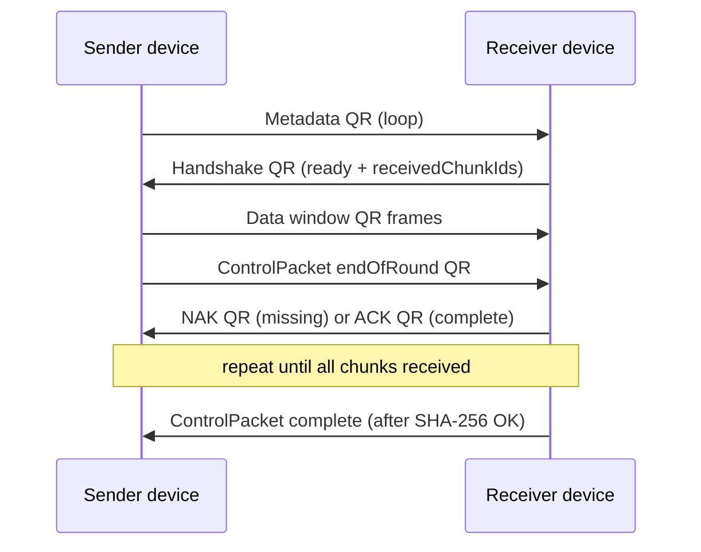

# PhotonLink Architecture

## Overview

PhotonLink is an offline peer-to-peer file transfer platform using optical communication (QR codes, color matrices, visual frame streams). **Phase 3** adds a **transport-agnostic reliability layer** (ACK/NAK, missing-packet recovery, retry, session resume) and a **round-based bidirectional QR protocol** where each device alternates between displaying and scanning QR frames.

## Layer Diagram

```
┌──────────────────────────────────────────────────────────┐
│  features/  home · transfer_setup · qr_transfer · about   │
│             camera_scan · file_picker (non-QR prototypes)  │
├──────────────────────────────────────────────────────────┤
│  transfer/  core (chunking, reconstruction, integrity)   │
│             reliability (ACK/NAK/retry/diagnostics)      │
│             state (13-phase state machine)               │
│             persistence (chunk store, session index)     │
│             qr (frame codec, stream + status frames)     │
│             application (Riverpod controllers)           │
├──────────────────────────────────────────────────────────┤
│  protocols/ interfaces + reliability/ + impl (QrProtocol)│
│  settings/  │  history/  │  shared/widgets/  │  ui/       │
├──────────────────────────────────────────────────────────┤
│  core/  bootstrap · router · theme · constants · errors  │
└──────────────────────────────────────────────────────────┘
         │                              │
         ▼                              ▼
   path_provider + SharedPreferences   native/photonlink_core
   (history, session index)            (Rust stub — future FFI)
   appDocs/photonlink_sessions/        (per-chunk disk store)
```

## Dependency Rules

| Layer | May import from | Must NOT import |
|-------|----------------|-----------------|
| `ui/` | (none — leaf) | everything else |
| `core/` | `ui/`, `services/` | `features/` |
| `services/` | `core/` | widgets, features |
| `protocols/` | `core/`, `transfer/core/` | widgets, features |
| `transfer/core/` | `protocols/interfaces/` | widgets, features, `transfer/qr/` |
| `transfer/reliability/` | `protocols/interfaces/reliability/` | widgets, features, Flutter |
| `transfer/state/` | (self) | widgets, features |
| `transfer/persistence/` | `protocols/`, `transfer/reliability/models/` | widgets, features |
| `transfer/qr/` | `protocols/`, `transfer/core/` | widgets, features |
| `transfer/application/` | `transfer/*`, `history/`, `services/` | widgets |
| `features/` | all above | — |

**Key rule:** Color Matrix, Optical Stream, and Audio (Phase 4+) reuse `transfer/core/`, `transfer/reliability/`, and `protocols/interfaces/` without importing `transfer/qr/`.

## Bidirectional QR Protocol (Phase 3)

Each device has **screen + camera**. Roles alternate by `TransferPhase`:



Manual **Show status / Resume sending** buttons on each screen provide a fallback when automatic turn handoff is missed.

## Wire Format (PL2)

```
PL2|<type>|<sessionId>|<seq>|<total>|<base64Payload>
```

| Type | Packet | Payload |
|------|--------|---------|
| `M` | `MetadataPacket` | JSON (fileName, fileSize, totalChunks, sha256, mimeType) |
| `D` | `DataPacket` | Raw chunk bytes (Base64, not UTF-8) |
| `A` | `AckPacket` | JSON (`packetIds`, `timestamp`) |
| `N` | `NakPacket` | JSON (`missingPacketIds`, `timestamp`) |
| `H` | `HandshakePacket` | JSON (`receivedChunkIds`, `timestamp`) |
| `C` | `ControlPacket` | JSON (`type`, `timestamp`) — `ready`, `endOfRound`, `complete`, `pause`, `cancel`, `resumeRequest` |

High QR error correction (`QrErrorCorrectLevel.H`). `QrStreamController` supports continuous data looping and single **status/control** frames via `showStatusFrame()`.

## Transport-Independent Interfaces

### Packets (`lib/protocols/interfaces/transfer_packet.dart`)

Sealed `TransferPacket`: `MetadataPacket`, `DataPacket`, `AckPacket`, `NakPacket`, `HandshakePacket`, `ControlPacket`.

### Core transfer (`lib/protocols/interfaces/`)

| Interface | Role |
|-----------|------|
| `TransferEncoder` / `TransferDecoder` | Frame encode/decode |
| `ChunkManager` | `split()` / `merge()` |
| `TransferSession` | Session metadata and progress |

### Reliability (`lib/protocols/interfaces/reliability/`)

| Interface | Implementation |
|-----------|----------------|
| `AcknowledgementManager` | `acknowledgement_manager_impl.dart` |
| `MissingPacketTracker` | `missing_packet_tracker_impl.dart` — Set-based O(1), range compaction |
| `RetryManager` | `retry_manager_impl.dart` + `RetryPolicy` |
| `TransferRecoveryManager` | `transfer_recovery_manager_impl.dart` |
| `SessionPersistenceManager` | `session_persistence_manager_impl.dart` |
| `DiagnosticsCollector` | `diagnostics_collector_impl.dart` + `TransferDiagnostics` |

None of the reliability implementations import Flutter or QR.

## State Machine (13 phases)

`lib/transfer/state/transfer_phase.dart` + `transfer_state_machine.dart`

Phases: `idle`, `preparing`, `waitingForReceiver`, `transmitting`, `receiving`, `awaitingAcknowledgements`, `recoveringMissingPackets`, `paused`, `resuming`, `reconstructing`, `completed`, `failed`, `cancelled`.

Validated transition table with sender/receiver role guards; invalid transitions return `false` (never silently corrupt state). Terminal: `completed`, `failed`, `cancelled`.

UI helpers on `TransferPhase`: `showsQrDisplay`, `showsScanner` drive which widget is visible on sender/receiver screens.

## Persistence and Resume

| Component | Path | Role |
|-----------|------|------|
| `ReceivedChunkStore` | `appDocs/photonlink_sessions/<sessionId>/<chunkId>.bin` | O(1) per-chunk disk write |
| `SessionPersistenceManagerImpl` | SharedPreferences index | metadata, received IDs, phase, diagnostics, retry counts |
| `TransferRecoveryManager` | — | `missing = all − received` for resume |

Resume: receiver sends `HandshakePacket` with `receivedChunkIds`; sender transmits only missing chunks. App re-entry shows **Resume?** when a persisted in-progress session exists.

Legacy `SessionStore` is superseded by persistence managers; controllers use `ReliableTransferContext` to bundle managers.

## Controller Flow (round-based)

**Sender:** `preparing → waitingForReceiver (metadata QR) → transmitting (window) → endOfRound → awaitingAcknowledgements (scan NAK/ACK) → recovering/transmitting → completed`.

**Receiver:** `waitingForReceiver (scan metadata) → receiving → NAK/ACK QR → recovering → reconstructing (SHA-256) → complete control QR`.

Both use `TransferStateMachine`, reliability managers, and `DiagnosticsCollector` for live UI metrics.

## State Management (Riverpod 2)

| Provider | Purpose |
|----------|---------|
| `senderControllerProvider` | Bidirectional sender flow |
| `receiverControllerProvider` | Bidirectional receiver flow |
| `ackManagerProvider`, `missingTrackerProvider`, … | Reliability layer DI |
| `stateMachineProvider` | Per-role state machine |
| `sessionPersistenceProvider`, `chunkStoreProvider` | Resume |
| `historyProvider` | History v2 (`transfer_history_v2`) |

## Navigation

| Route | Screen |
|-------|--------|
| `/` | Home |
| `/transfer/:method` | Transfer Setup |
| `/qr/send` | QR Sender (QR display + scanner by phase) |
| `/qr/receive` | QR Receiver (scanner + QR display by phase) |
| `/qr/complete` | Completion + diagnostics summary |
| `/history` | History list + detail sheet |
| `/settings`, `/about` | Settings, About |

## History (v2)

`TransferRecord` fields: `sessionId`, `durationMs`, `retryCount`, `failureReason` (plus status, method, timestamp, fileName). Repository key `transfer_history_v2` with defaults for migrated v1 records.

## Test Coverage (Phase 3)

| Area | Tests |
|------|-------|
| Core | `chunk_manager`, `chunk_ordering`, `reconstruction`, `reconstruction_hardening`, `integrity` |
| QR codec | `qr_codec_test`, `qr_codec_validation_test`, `qr_reliability_codec_test` |
| Reliability | `ack_manager_test`, `nak_tracker_test`, `retry_manager_test` |
| State | `state_machine_test` |
| Integration | `resume_recovery_test` |
| UI | `widget_test` |

Run: `cd photonlink_app && flutter test` (35+ tests).

## Known Limitations

- Max file size 512 KB (`TransferLimits`)
- History append rewrites full JSON list (SQLite deferred)
- No compression, encryption, Reed-Solomon, or fountain codes
- Color Matrix / Optical Stream / Audio still `isAvailable: false`
- Manual two-device QR timing depends on frame rate and lighting

## Phase 4+ Roadmap

- **Color Matrix / Optical Stream / Audio:** implement `TransferEncoder`/`Decoder` per transport; inject same reliability managers and state machine
- Rust FFI acceleration for chunking/hash
- Compression and encryption
- SQLite history backend
