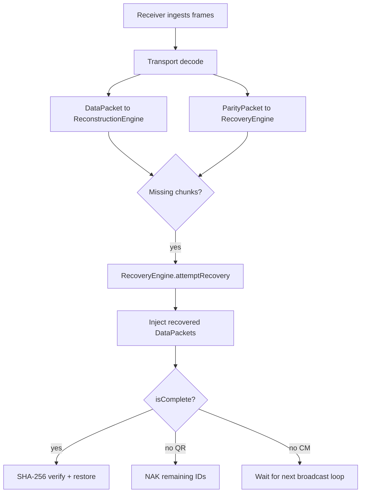

# FEC Architecture (Phase 7)

PhotonLink Phase 7 adds transport-independent Forward Error Correction using Reed-Solomon erasure coding with parity packets.

## Components

| Component | Path | Role |
|-----------|------|------|
| `FecConfiguration` | `lib/transfer/fec/models/fec_configuration.dart` | Runtime FEC settings |
| `FecProfile` | `lib/transfer/fec/models/fec_profile.dart` | Low / Balanced / High / Maximum / Auto |
| `FecEncoder` | `lib/transfer/fec/fec_encoder.dart` | Generates `ParityPacket`s |
| `FecDecoder` | `lib/transfer/fec/fec_decoder.dart` | Recovers missing `DataPacket`s |
| `RecoveryEngine` | `lib/transfer/fec/recovery_engine.dart` | Orchestrates recovery + stats |
| `ReedSolomonCodec` | `lib/transfer/fec/reedsolomon/` | GF(256) systematic RS |
| `ErasureCode` | `lib/transfer/fec/erasure_code.dart` | Fountain-code-ready interface |

## Recovery Flow

## Reed-Solomon Workflow

1. **Block planning**: Data chunks grouped into blocks of size `blockSize` (default 10).
2. **Redundancy**: `m = ceil(k * redundancyPercent / 100)` parity symbols per block.
3. **Encoding**: Byte-level RS over GF(256); data symbols sent as-is, parity computed via Vandermonde generator matrix.
4. **Decoding**: Missing data symbols recovered from available data + parity using Gaussian elimination in GF(256).

## FEC Profiles

| Profile | Redundancy | Use Case |
|---------|------------|----------|
| Low Protection | 5% | Clean channel, minimal overhead |
| Balanced | 10% | Default |
| High Protection | 20% | Noisy environments |
| Maximum Reliability | 30% | Critical transfers |
| Auto | Adaptive | Uses adaptive engine + manual override |

## Transport Integration

- **QR**: Wire type `P` in PL2 codec; parity sent on first full data round.
- **Color Matrix**: `packetType = 2` (parity) in PLCM v1 serializer.
- Recovery logic is 100% in the FEC layer; transports only carry bytes.

## Fountain Code Preparation

`ErasureCode` interface reserved for future implementations:

- `FecCodecType.ltCodes` — LT Codes
- `FecCodecType.raptor` — Raptor
- `FecCodecType.raptorQ` — RaptorQ

Integration point: swap `ReedSolomonCodec` in `FecEncoder`/`FecDecoder` via `FecConfiguration.codecType`.

## Performance Tradeoffs

| Factor | Impact |
|--------|--------|
| Redundancy % | More parity = higher recovery rate, lower throughput |
| Block size | Larger blocks = fewer headers, coarser recovery granularity |
| FEC CPU | RS encode/decode is O(k³) per byte position per block |
| Memory | Parity buffers sized to max chunk payload in block |

## Known Limitations

- Color Matrix remains one-way; FEC reduces but cannot eliminate loss without sufficient parity across loops.
- RS block size capped at 255 symbols (GF(256)).
- No Fountain codes, ML, GPU acceleration in Phase 7.
